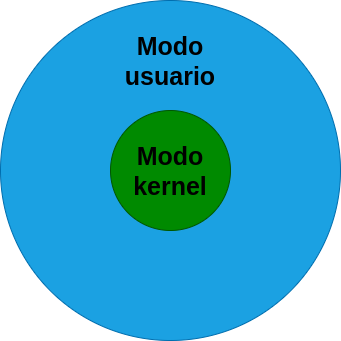

## Datos del estudiante
- **Estudiante:** Carlos Ernesto Fuentes Rasique
- **Carnet:** 201503756
- **Fecha:** 25/01/2023

## Contenido
+ [Tipos de Kerner y sus diferencias](#tipos_kernel)
+ [User mode vs Kernel Mode](#modo_kernel_usuario)

---

### Tipos de Kernel y sus diferencias
| Tipo | Descripción | 
| -- | -- |
| Kernel Modular | Se centran en las funcionalidades escenciales como la administracion de memoria, la planificación de procesos etc. |
| Kernel Monolítico | Se trata de un programa de tamaño considerable que se debe recompilar por completo cada vez que se quiera agregar una nueva posibilidad. |
| Microkernel | Proporcionan un pequeño conjunto de abstraciones simples del hardware y usan las aplicaciones llamadas servidores para ofrecer  mayor funcionalidad. |
| Hurd | GNU Hurd  es un conjunto de programas servidores que simulan un núcleo Unix que se establece la base del sistema operativo GNU. |

---

### User mode vs Kernel Mode
| User mode | Kernel Mode |
| --- | --- |
| En este modo los programas no pueden modificar la paginación directamente, por lo tanto no se tiene la capacidad de acceder a la memoria de otros programas, excepto a través de las funciones API. Los programas en modo usuario no pueden interferir con las interrupciones y el cambio de contexto. Por ejemplo, cuando un programa quiere acceder a la cámara web, el programa debe pasar por el kernel por medio de una llamada y de esta forma realizar dicha petición.  |  Es el programa central en el que se basan todos los demás componentes del sistema operativo, se utiliza para acceder a los componentes del hardware y programar los procesos que debe ejecutarse en el sistema. Administra la interacción entrel software y hardware. Es por esta razón que es el programa más privilegiado ya que puede interactuar directamente con el hardware. |

#### Imagen de como se estructura el modo usuario y el modo kernel.